### Live Deployement Link:

- http://testlb-tf-1189869329.us-east-1.elb.amazonaws.com/

## Steps

- [1. Build Docker image for the Flask app](#step-1)
- [2. Create an Amazon ECR repository](#step-2)
- [3. Authenticate Docker with ECR and push the image](#step-3)
- [4. Create VPC networking](#step-4)
- [5. Create ECS cluster](#step-5)
- [6. Create ECS task definition](#step-6)
- [7. Create security groups](#step-7)
- [8. Create ELB and target group](#step-8)
- [9. Create ECS service and attach it to the load balancer](#step-9)
- [10. Verify deployment with test screenshots](#step-10)

---

### <a id="step-1"></a>1. Build Docker Image for the Flask App

- Directory: [flask-app](flask-app)

### <a id="step-2"></a>2. Create an Amazon ECR Repository

- On AWS ECR:
  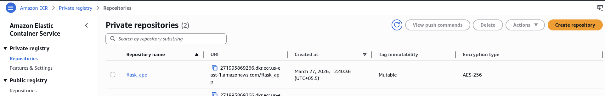
  - Install AWS Cli
  - Configure ENV with Access Key from AWS

### <a id="step-3"></a>3. Authenticate Docker with ECR and Push the Image

- Steps to Build and Push Image:

  ```bash
  aws ecr get-login-password --region eu-central-1 | docker login --username AWS --password-stdin <UserID>.dkr.ecr.eu-central-1.amazonaws.com
  docker tag flask-app:latest <UserID>.dkr.ecr.eu-central-1.amazonaws.com/flask-app:latest
  docker push <UserID>.dkr.ecr.eu-central-1.amazonaws.com/flask-app:latest
  ```

- Image Pushed:
  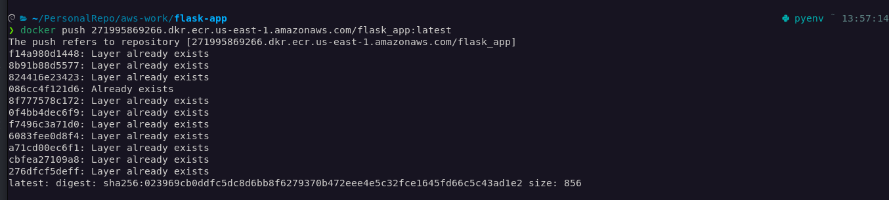
- On AWS ECR:
  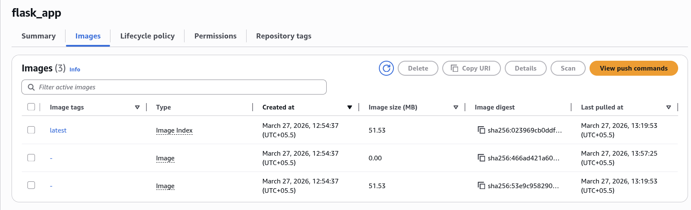

### <a id="step-4"></a>4. Create VPC Networking

- Create VPC (Virtual Private Cloud)
  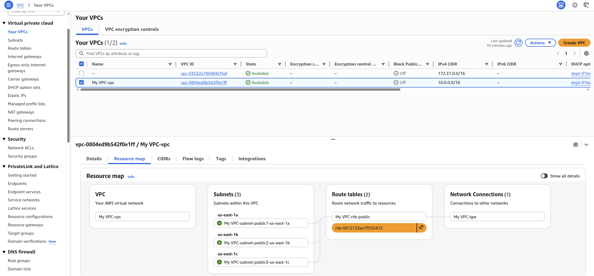
  - Base CIDR: 10.0.0.0/16
  - Public Subnets (3 AZ's)
    - 10.0.0.0/24
    - 10.0.1.0/24
    - 10.0.2.0/24
  - Route Table
  - IGW (Internet Gateway)

### <a id="step-5"></a>5. Create ECS Cluster

- ECS Cluster
  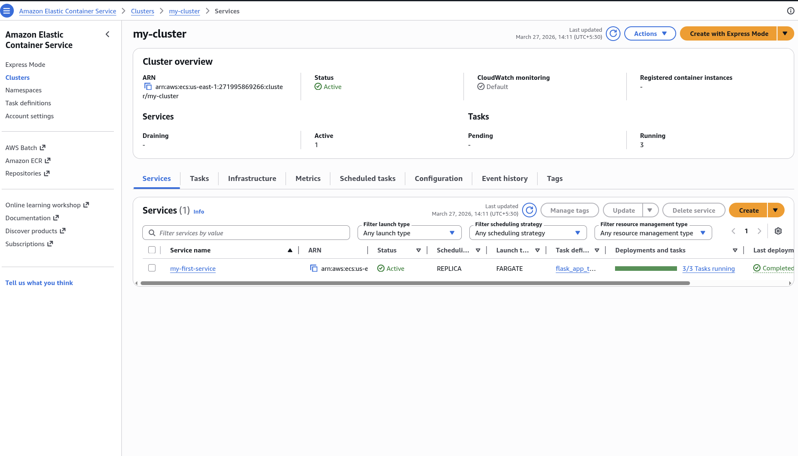

### <a id="step-6"></a>6. Create ECS Task Definition

- Container Configuration
  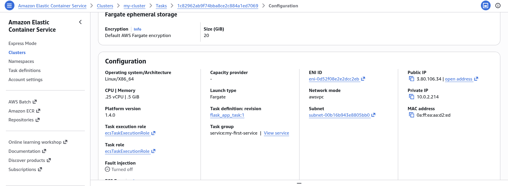
- Container Network
  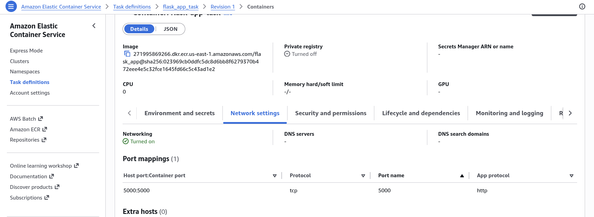

### <a id="step-7"></a>7. Create Security Groups

- Load Balancer SG
  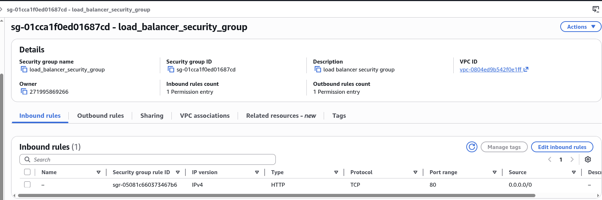

- ECS Service SG
  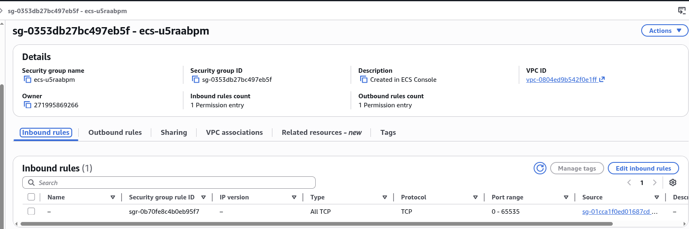

### <a id="step-8"></a>8. Create ELB and Target Group

- Load Balancer
  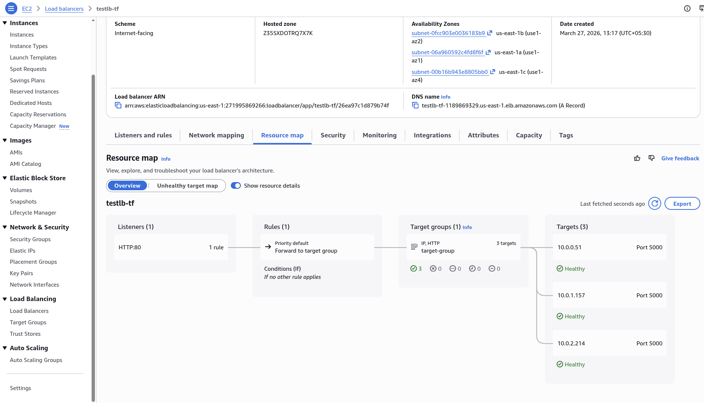
- Target Group
  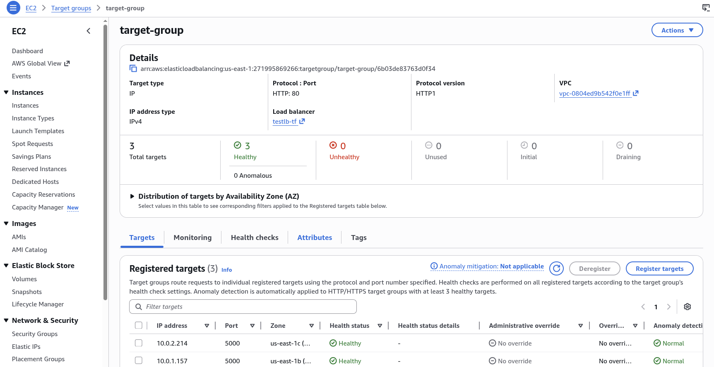

### <a id="step-9"></a>9. Create ECS Service and Attach It to the Load Balancer

- ECS Service
  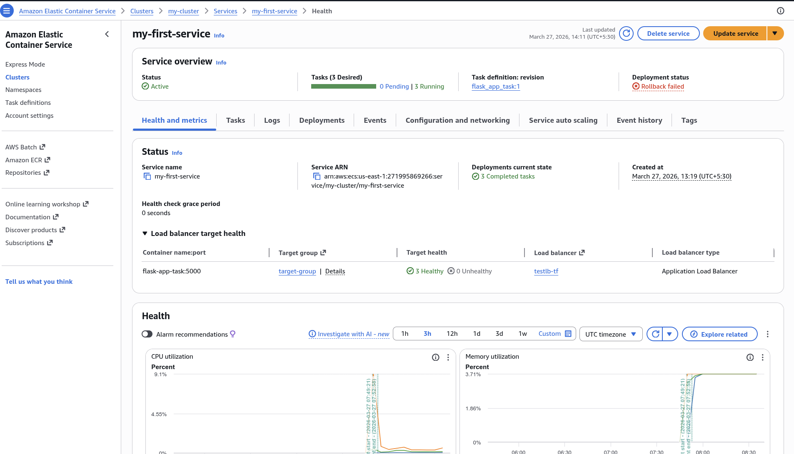
- ECS Service Tasks
  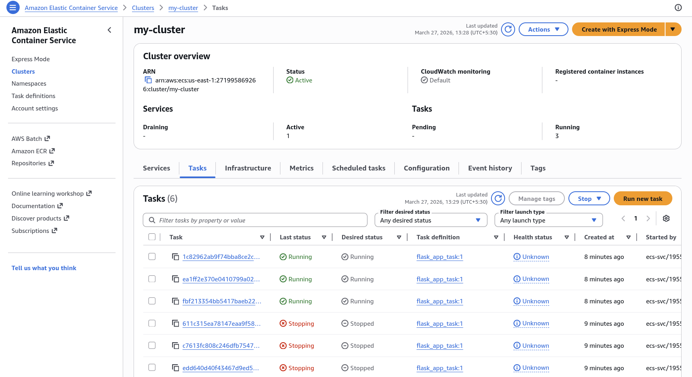

### <a id="step-10"></a>10. Verify Deployment with Test Screenshots

- Test 1
  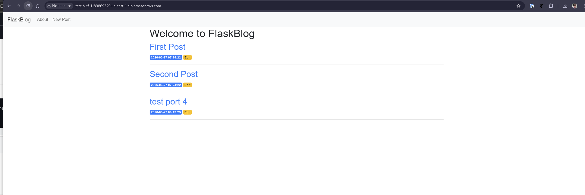
- Test 2
  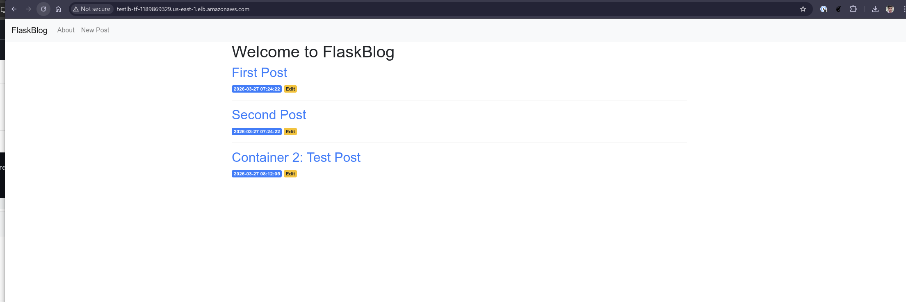
- Test 3
  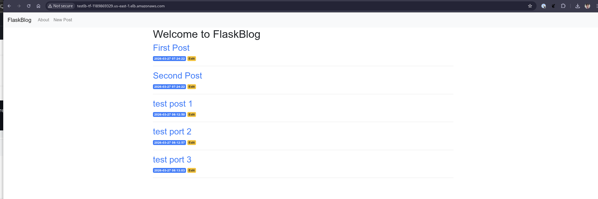
